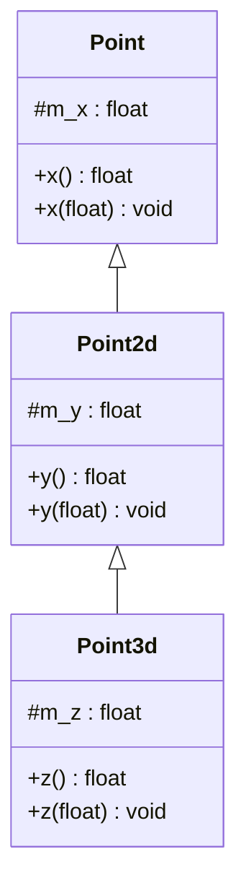

# 第一章 关于对象

在C语言中，“数据”和“函数”（处理数据的操作）是分开声明的。例如，声明一个 `struct Point3d`

```c
typedef struct poiont3d
{
    float x;
    float y;
    float z;
} Point3d;
```

对于 `Point3d` 的操作，我们就需要另外的定义函数，比如打印一个 `Point3d`

```c
void Point3d_print(const Point3d *p)
{
    printf("(%g, %g, %g)", pd->x, pd->y, pd->z);
}
```

打印一个 `Point3d` 不仅这一种方法，我们还可以用宏，或是直接在程序中直接操作

```c
// 宏
#define Point3d_print(pd) \
	printf("(%g, %g, %g)", pd->x, pd->y, pd->z);
// 直接在程序中完成操作
void my_foo()
{
    Point3d *pd = get_a_point();
    //...
    /* 直接打印出 point ... */
    printf("(%g, %g, %g)", pd->x, pd->y, pd->z);
}
```


在C++ 中 `Point3d` 有可能采用独立的 “抽象数据类型” 来实现：

```cpp
class Point3d
{
public:
    Point3d(float x = 0.0, float y = 0.0, float z = 0.0)
        : m_x(x), m_y(y), m_z(z) { }
    float x() { return m_x; }
    float y() { return m_y; }
    float z() { return m_z; }
    
    void x( float val) { m_x = val; }
    // ... etc ...
    
private:
    float m_x;
    float m_y;
    float m_z;
    
    inline ostream&
   	operator<<(ostream &os, const Point3d &pt)
    {
        os << "(" << pt.x() << ", " 
            << pt.y << ", " << pt.z() << ")" ;
    }
};
```

以上只是一种最基本的实现的方式，我们还可以使用继承的机制实现



更进一步，我们还可以对数据类型参数化，使用C++的模板语法特性

```cpp
template< typename type>
class Point3d {
  // ...  
};
// 数据类型和点的纬度参数化
template< typedef type, int dim > 
class Point {
    // ...
};
```

C的数据和函数分开，以及C++以类的形式定义抽象类型，它们在内存空间的成本是一致的，都只是数据占用了内存。C++ 的类中的方法并不会占用多余的资源，C++ 类占用多余资源主要是 **虚函数** 和 **虚继承** 引起的，它们都需要另外维护 **虚表**。


## 1.1 C++ 对象模型

在C++中，有两种类数据成员 (class data member) : 静态 (static) 和 非静态 (nonstatic) , 以及三种类方法成员(class member function) : 静态 (static) 、非静态 (nonstatic) 和 虚方法 (virtual) :

```cpp
class Point {
public:
    Point(float val);
    virtual ~Point();
    
    float x() const;
    static int PonitCount();
    
protected:
    virtual ostream&
        print(ostream &os) const;
    
    float m_x;
    static int m_point_count;
};
```

这样一个类的对象模型，我们能够想到最简单的模型是每个成员的地址保存在一段连续的内存中。这里之所以保存地址，是因为数据和函数的长度不是统一的，保存的时候不好计算


