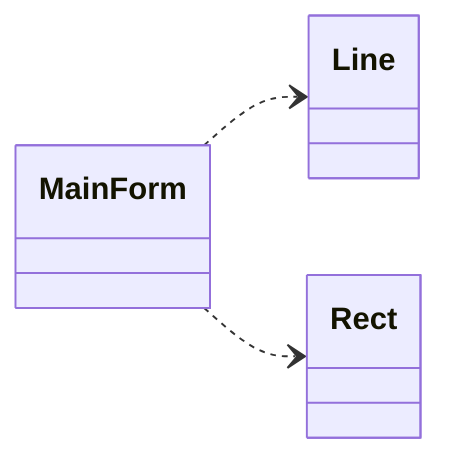
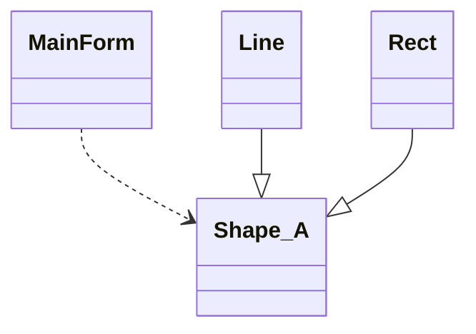

# 面向对象设计原则

在变化中寻找稳定，隔离变化

## 1. 依赖倒置原则（DIP）

- 高层模块（稳定）不应该依赖于低层模块（变化），二者都应该依赖于抽象
- 抽象（稳定）不应该依赖于实现细节（变化），实现细节应该依赖于抽象（稳定）

MainForm 依赖于 Line和Rect，这是具体的实现，应该依赖于抽象

## 2. 开放封闭原则
- 对扩展开放，对更改封闭
- 类模块应该可扩展，但是不可修改

## 3. 单一职责原则
- 一个类应该仅有一个引起它变化的原因，
- 变化的方向隐含着类的责任

## 4. 替换原则
- 子类必须能够替换它的基类（IS-A），
- 继承可以表达类型抽象。

## 5. 接口隔离原则
- 接口应该小而完备，不用把不使用的方法 public
- 不该强迫用户使用多余的方法。

## 6. 优先使用组合而不是继承
- 类继承通常为 “白箱复用”，对象组合通常为“黑箱复用”
- 继承在某种程度上破坏了封装性，子类非类耦合度靠
- 对象组合则只要求被组合的对象具有良好定义的接口耦合度低

## 7. 封装变化点
- 使用封装来创建变化点

## 8. 针对接口编程
而不是针对实现编程。

## 复用
面向对象的复用是二进制级的，以编译文件位基本单位

## 从封装变化角度对模式分类

- 组件协作
  - Template Method
  - Observer / Event
  - Strategy

- 单一职责
  - Decorator
  - Bridge

- 对象创建
  - Factory Method
  - Abstract Factory
  - Prototype
  - Builder

- 对象性能
  - Singleton
  - Flyweight

- 接口隔离
  - Facade
  - Proxy
  - Mediator
  - Adapter

- 状态变化
  - Memento
  - State

- 数据结构
  - Composite
  - Iterator
  - Chain of Resposibility

- 行为变化
  - Command
  - Visitor
  
- 领域问题
  - Interpreter

**Refactoring to Patterns**
